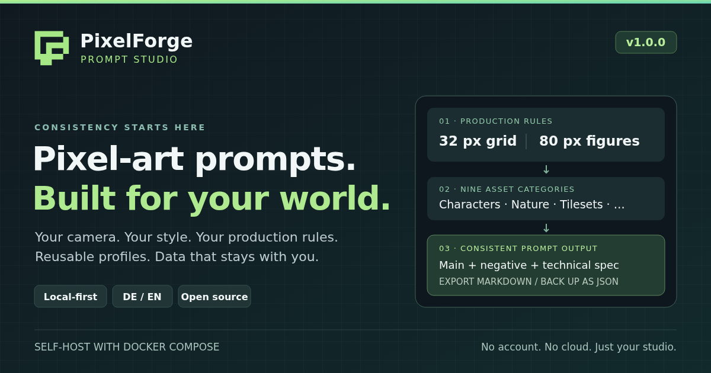
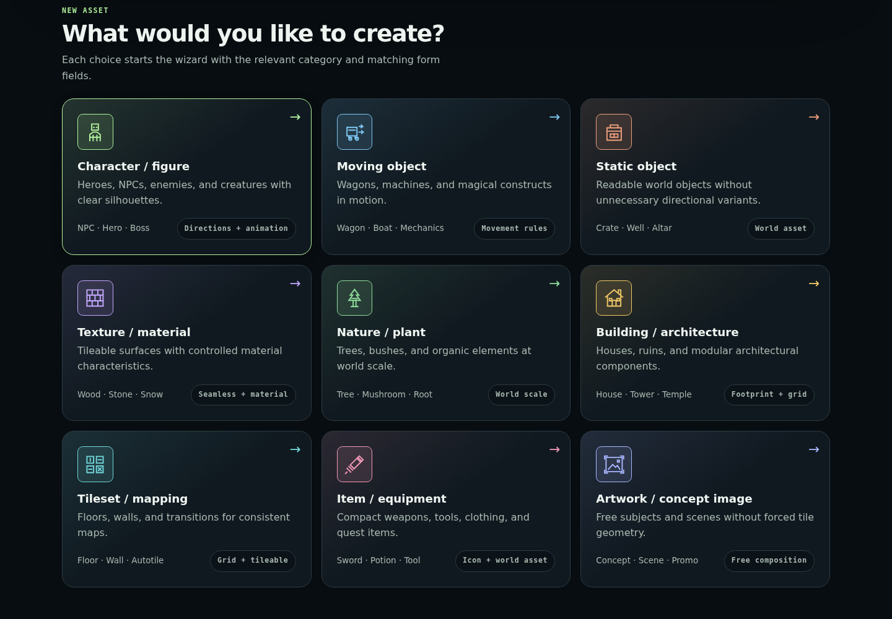
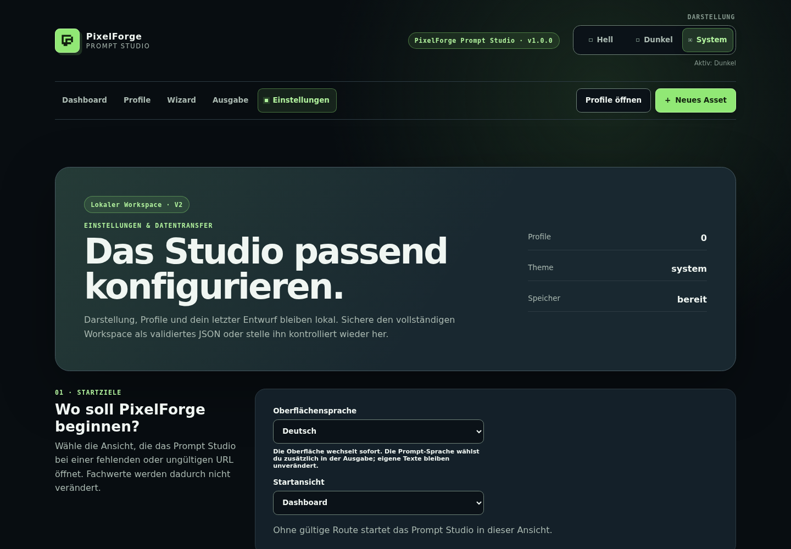

# PixelForge Prompt Studio



Local-first prompt studio for consistent pixel-art production.

**Version 1.0.0** · German / English · browser-local data · MIT

Create reusable production profiles, follow a category-aware wizard, and
export main prompts, negative prompts, technical specifications or a combined
Markdown document. Nine asset categories share consistent camera, scale,
material, lighting and pixel-style rules. This app creates prompts, not images.



## What you can do

- Keep production values consistent with reusable base/category/asset profiles and locks.
- Ask only relevant questions for characters, objects, textures, nature, buildings,
  tilesets, equipment and free artwork.
- Work in German or English with keyboard-friendly dark/light/system themes.
- Export readable Markdown prompts and validated JSON workspace backups.
- Self-host a small static app with Docker Compose; no server database to maintain.



## Quick start

Use the Node.js version in [`.node-version`](.node-version) and its bundled npm:

```bash
npm ci
npm run dev
```

Open `http://127.0.0.1:4173`. If `vite` is missing, run `npm ci` first with
development dependencies enabled. `npm start` also opens the browser.

## Docker Compose

```bash
docker compose up --build -d --wait
```

Open `http://127.0.0.1:8080`. The non-root production container binds to
loopback by default. See [self-hosting](docs/SELF-HOSTING.md) for server ports,
HTTPS, static hosting without Docker, updates and rollback.

## Your data

Profiles, settings and drafts stay in your browser's localStorage. There is no
backend, telemetry, API key or cloud account. Export your workspace as JSON
from Settings for backup or transfer. Server backups do not contain browser
data; changing host, port or HTTP/HTTPS creates a different storage origin.
Existing [schema-V2 data and migration contracts](docs/COMPATIBILITY.md) remain
compatible; product version 1.0.0 is independent of schema version 2.

Settings offers Deutsch and English; Output can choose its own prompt
language. [Custom text is preserved](docs/LOCALIZATION.md), not automatically
translated. Only the Prompt Studio is included; there is no animation-project
workspace, renderer or engine exporter.

## Development and documentation

```bash
npm run verify
npm run test:browser:install
npm run test:browser
```

`verify` checks documentation, TypeScript, tests and the production build.
`npm test` starts watch-mode tests. `npm run build` produces `dist/`;
`npm run preview` is for local review, not production hosting.

[Documentation](docs/index.md) · [Architecture](src/ARCHITECTURE.md) ·
[Changelog](CHANGELOG.md) · [Product identity](docs/BRANDING.md) ·
[Social preview](public/social-preview.png) ·
[Release gate](https://github.com/kleiveist/PixelForgeStudio/issues/9)

## Community

[Contributing](CONTRIBUTING.md) · [Community and governance](COMMUNITY.md) ·
[Support](SUPPORT.md) · [Security](SECURITY.md) · [Code of conduct](CODE_OF_CONDUCT.md)

Use GitHub Issues and pull requests; no external chat account is required.
Please share only invented, sanitized examples, never real workspace backups.

## License

[MIT](LICENSE). The npm package is private and is not published to npm.
Redistribution includes [third-party runtime notices](THIRD_PARTY_NOTICES.md).
